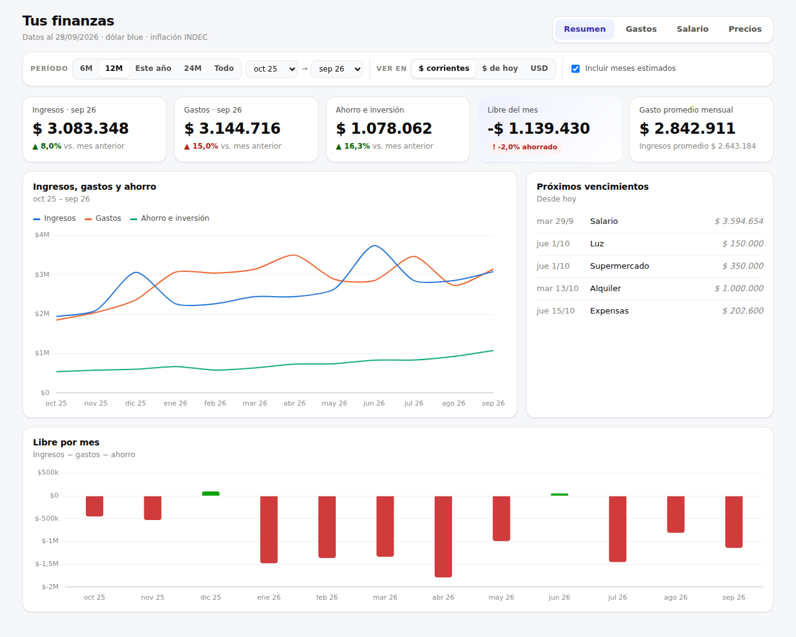
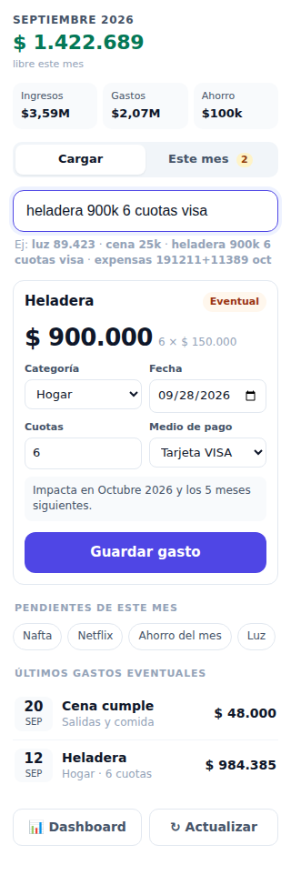
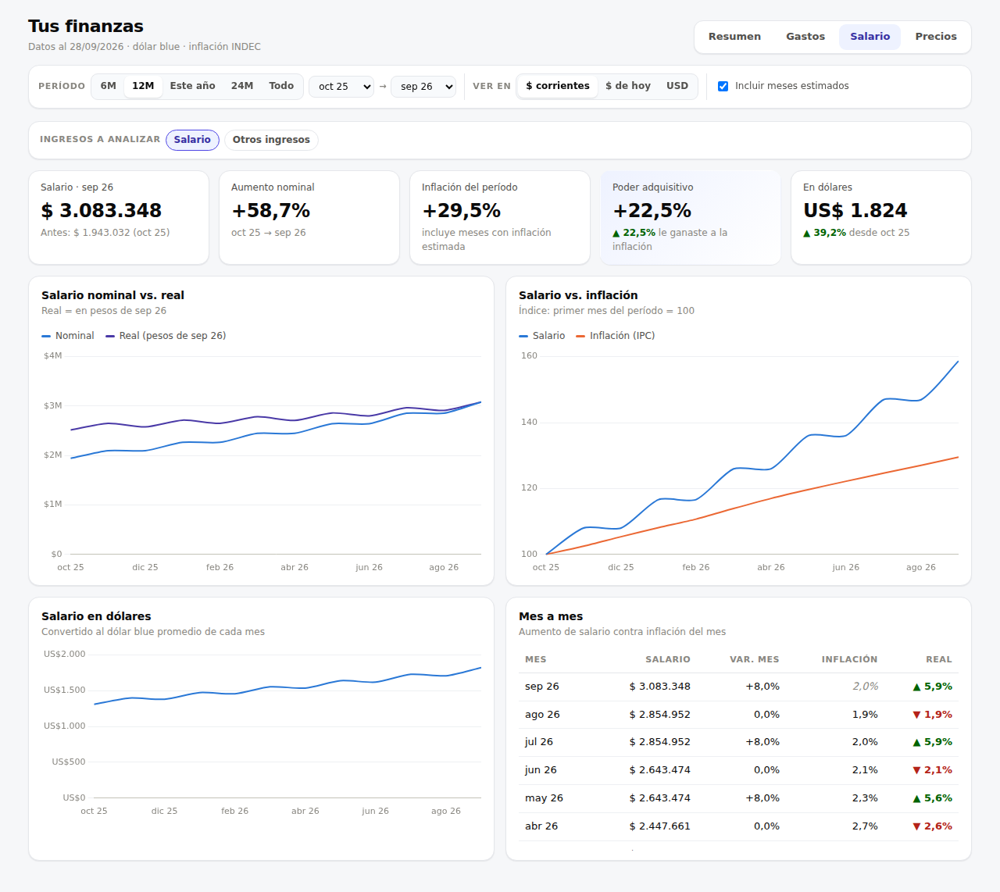

# 💰 Finanzas

Un "súper Excel" de finanzas personales que vive **dentro de tu Google Sheets**, con Apps Script.

La planilla sigue siendo una planilla: escribís en las celdas, hacés cuentas (`=1500*3`), insertás filas, copiás y pegás. El sistema agrega lo que un Excel no hace solo:

- **Arrastre de precios**: si la luz aumenta y lo cargás en septiembre, octubre, noviembre y los meses siguientes pasan a ese precio.
- **Vencimientos en palabras** (`15`, `10 hábil`, `1er hábil`, `último hábil`, `anteúltimo hábil`…), con feriados de Argentina, y sincronizados con tu **Google Calendar**.
- **Carga rápida**: escribís `heladera 900k 6 cuotas visa` y queda cargado, repartido en cuotas.
- **Dashboard**: salario real contra inflación (IPC INDEC), salario en dólares, aumentos por concepto, gastos por categoría, con filtros.
- **Siempre en el mes actual**: al abrir la planilla, los años anteriores se colapsan y la columna del mes queda resaltada.



> Las capturas usan datos ficticios.

---

## Índice

1. [Instalación (10 minutos)](#instalación-10-minutos)
2. [Cómo se usa](#cómo-se-usa)
3. [Automatizaciones](#automatizaciones)
   - [Deploy automático desde GitHub](#deploy-automático)
4. [Tu Excel anterior](#tu-excel-anterior)
5. [Preguntas frecuentes](#preguntas-frecuentes)
6. [Para desarrollar](#para-desarrollar)

---

## Instalación (10 minutos)

### 1. Poné el código en tu planilla

Abrí tu planilla de Google Sheets (la que tiene la hoja **Finanzas**) → **Extensiones → Apps Script**.

**Opción A · copiar y pegar** (sin instalar nada):

| En el editor de Apps Script creá… | …y pegale el contenido de |
|---|---|
| `Código.gs` (ya existe: borrá lo que tenga) | [`dist/Finanzas.gs`](dist/Finanzas.gs) |
| Archivo HTML llamado `Panel` | [`dist/Panel.html`](dist/Panel.html) |
| Archivo HTML llamado `Dashboard` | [`dist/Dashboard.html`](dist/Dashboard.html) |
| `appsscript.json` (⚙️ Configuración del proyecto → "Mostrar el archivo de manifiesto") | [`dist/appsscript.json`](dist/appsscript.json) |

**Opción B · con [clasp](https://github.com/google/clasp)** (si tenés Node):

```bash
npm i -g @google/clasp && clasp login
cp .clasp.json.example .clasp.json   # pegá el ID del proyecto (Configuración del proyecto → ID de la secuencia de comandos)
npm run push
```

**Opción C · automático desde GitHub** (recomendado): después de configurarlo una vez, cada cambio que llega a `main` se sube solo a Apps Script. Ver [Deploy automático](#deploy-automático).

### 2. Instalá

Volvé a la planilla y recargá la página. Aparece el menú **💰 Finanzas** → **⚙️ Instalar / actualizar sistema**.

- Google te va a pedir permisos (planilla, calendario, conexión a internet para inflación/dólar/feriados). Es tu propio script: aceptá con tu cuenta.
- Te pregunta si importa tu hoja **Finanzas** actual. Tu hoja original **no se borra**: queda como `Finanzas (original)`.
- Tarda alrededor de un minuto. Al terminar ves un resumen.

### 3. (Opcional) Cargar desde el celular

En Apps Script: **Implementar → Nueva implementación → Aplicación web** (Ejecutar como: *yo*; Acceso: *solo yo*). Te da una URL:

- `…/exec?v=panel` → carga rápida (guardala en la pantalla de inicio del celular).
- `…/exec` → dashboard.

---

## Cómo se usa

### La hoja Finanzas

```
                      │ ... │ agosto │ SEPTIEMBRE │ octubre │ noviembre │ Total 2026
──────────────────────┼─────┼────────┼────────────┼─────────┼───────────┼───────────
Ingresos              │     │        │ ▓▓▓▓▓▓▓▓▓▓ │         │           │
Gastos                │     │        │ ▓ mes      │         │           │
Ahorro e inversión    │     │        │ ▓ actual   │         │           │
Libre del mes         │     │        │ ▓▓▓▓▓▓▓▓▓▓ │         │           │
INGRESOS              │     │        │            │         │           │
  Salario             │     │ 3.526k │ 3.594k     │ 3.594k  │ 3.594k    │   ← gris itálica = estimado
GASTOS FIJOS          │     │        │            │         │           │
  ▸ Servicios         │     │ subtotal automático                        │
      Luz             │     │ 108k   │ 89k        │ 89k     │ 89k       │
```

- Las filas **Ingresos / Gastos / Ahorro / Libre** de arriba quedan siempre visibles.
- **Negro** = lo cargaste vos (confirmado). **Gris itálica** = lo completó el sistema (estimado).
- Las secciones y categorías muestran su subtotal y se pliegan con el `−` del margen izquierdo.
- Cada año tiene su columna **Total**; los años anteriores se pliegan solos al abrir.

**Columnas de la izquierda** (se pliegan con el `−` de arriba):

| Columna | Qué poner |
|---|---|
| **Concepto** | El nombre. Para agregar uno: insertá una fila dentro de la categoría y escribí el nombre. |
| **Vence** | Cuándo vence, en palabras (ver tabla abajo). |
| **Próximo** | Automático: la próxima fecha de vencimiento. Se pinta de amarillo si faltan ≤ 3 días. |
| **Medio de pago** | `Débito automático`, `Tarjeta VISA`, etc. Los débitos automáticos se confirman solos el día que vencen. |
| **Proyección** | Cómo completar los meses futuros: `Repetir` (por defecto), `Promedio 3 meses` (luz, gas), `Ajustar por inflación`, `No proyectar` (aguinaldo, bonos). |

### Escribir montos

Como en Excel: `89423`, `=10615+178223`, `=2828*3*4`, o referencias (ej. en la columna de septiembre 2026, `=AO$3*20%` = 20 % de los ingresos de ese mes, fila 3). Al proyectar, las fórmulas se copian a los meses siguientes y sus referencias se desplazan como al arrastrar en Excel.

- **Aumentó algo** → escribí el precio nuevo en ese mes. Los estimados siguientes se actualizan hasta el próximo valor que hayas cargado vos.
- **Sé un precio futuro** (ej. el alquiler sube en marzo) → cargalo en marzo: se respeta y desde ahí se proyecta ese valor.
- **Di de baja algo** → poné `0` en el primer mes que ya no se paga.

### Vencimientos: qué se puede escribir

| Escribís | Significa |
|---|---|
| `15` | El día 15 (si el mes es más corto, el último día) |
| `10 hábil` | El 10, o el siguiente día hábil si cae fin de semana o feriado |
| `18 hábil anterior` | El 18, o el día hábil anterior |
| `1er hábil`, `2do hábil`, `5to día hábil`, `quinto hábil` | El N-ésimo día hábil del mes |
| `último hábil`, `anteúltimo hábil` | Contando días hábiles desde el final |
| `último día`, `anteúltimo día`, `fin de mes` | Contando días corridos desde el final |
| `primer lunes`, `último viernes`, `2do martes` | Por día de la semana |

Al escribir la regla, un aviso te confirma cómo la entendió y cuál es la próxima fecha. Los feriados vienen de la hoja **Config** (se descargan solos; podés agregar los tuyos).

### Carga rápida (menú 💰 Finanzas → ➕ Cargar)



Una sola caja de texto. Ejemplos:

| Escribís | Pasa |
|---|---|
| `luz 89.423` | Confirma la luz de este mes en $ 89.423 y actualiza los meses siguientes |
| `expensas 191211+11389 oct` | Carga la cuenta como fórmula en octubre |
| `cena 25k` | Gasto eventual de $ 25.000, categoría *Salidas y comida* |
| `heladera 900k 6 cuotas visa` | $ 150.000 por mes durante 6 meses desde el mes siguiente (tarjeta) |
| `coto 19/07 57500` | Con fecha |
| `salario 3.600.000 mes que viene` | Carga el ingreso en el mes siguiente |

Antes de guardar ves exactamente qué va a hacer. Después de guardar tenés **Deshacer**. La categoría se aprende de lo que cargaste antes.

La pestaña **Este mes** lista los vencimientos del mes: lo estimado (por pagar) con un botón ✓ para confirmarlo, y lo ya confirmado.

<br clear="right">

### Gastos eventuales y cuotas (hoja Movimientos)

Los gastos sueltos van a **Movimientos**, una fila por gasto: fecha, descripción, categoría, monto, cuotas, medio de pago. La sección **EVENTUALES** de Finanzas los suma sola por categoría y por mes, repartiendo las cuotas.

- Compras con tarjeta impactan el mes siguiente (se puede apagar en Config).
- Para imputar un gasto a otro mes, completá **Mes (opcional)**.
- Si escribís directo en Movimientos, la fecha y la categoría se completan solas.
- **Categorías**: son las filas de la sección EVENTUALES. Agregá una fila ahí para crear una categoría nueva.

### Dashboard (menú 💰 Finanzas → 📊 Dashboard)

Filtros arriba para todo: período (6M, 12M, este año, 24M, todo o desde/hasta), moneda (**$ corrientes**, **$ de hoy** ajustados por inflación, **USD**) e incluir o no meses estimados.

| Vista | Qué muestra |
|---|---|
| **Resumen** | Ingresos, gastos, ahorro y libre del mes con variación; evolución; próximos vencimientos |
| **Gastos** | Barras por categoría (o sección), ranking con variación contra el período anterior y detalle por concepto |
| **Salario** | Nominal vs. real, índice salario vs. IPC, salario en dólares, tabla mes a mes. **Poder adquisitivo** = cuánto le ganaste (o perdiste) a la inflación |
| **Precios** | Cuánto aumentó cada gasto fijo contra la inflación del mismo período, y tu "canasta" de fijos vs. IPC |

| | |
|---|---|
|  |  |

### Índices y configuración

- **Índices**: inflación mensual (INDEC) y dólar oficial/blue (promedio mensual). Se actualizan solos una vez por semana desde [ArgentinaDatos](https://argentinadatos.com) (respaldo: [datos.gob.ar](https://datos.gob.ar)). Si corregís una fila a mano queda marcada "manual" y se respeta.
- **Config**: preferencias generales (meses a proyectar, calendario, aviso previo, medios de pago…) y la tabla de feriados. Todo lo demás se configura en la propia fila de cada concepto.

---

## Automatizaciones

| Qué | Cuándo |
|---|---|
| Proyectar meses futuros (arrastre de precios) | Al editar un monto, al cambiar el modo de proyección y cada mañana |
| Subtotales, totales anuales, resumen | Al insertar/borrar filas o cambiar nombres (y con 🔧 Reparar) |
| Próximo vencimiento + aviso si faltan ≤ 3 días | Al escribir la regla y cada mañana |
| Confirmar débitos automáticos | El día del vencimiento (7 AM) |
| Cerrar el mes: los estimados del mes que terminó pasan a confirmados | El primer día del mes |
| Agregar el año siguiente (12 meses + total) | Cuando el horizonte de proyección lo necesita |
| Eventos en Google Calendar (calendario "Finanzas", aviso a las 9:00 del día anterior) | Cada mañana; ✓ en el título cuando está pagado |
| Inflación, dólar y feriados | Semanal / anual |
| Fecha y categoría en Movimientos | Al escribir una descripción |
| Enfocar el mes actual y plegar años anteriores | Al abrir la planilla |

---

## Deploy automático

El workflow [`.github/workflows/deploy-apps-script.yml`](.github/workflows/deploy-apps-script.yml) corre los tests y sube `apps-script/` a tu proyecto con [clasp](https://github.com/google/clasp) cada vez que se actualiza `main` (o a mano: pestaña **Actions → Deploy a Apps Script → Run workflow**). Si un test falla, no se sube nada.

**Configuración (una sola vez, ~5 minutos, en tu computadora con Node instalado):**

1. Activá la API de Apps Script: <https://script.google.com/home/usersettings> → *Google Apps Script API* → **Activado**.
2. Iniciá sesión con clasp (abre el navegador para autorizar tu cuenta de Google):
   ```bash
   npx @google/clasp@2.4.2 login
   ```
   Esto crea el archivo `~/.clasprc.json` (en Windows: `C:\Users\TU_USUARIO\.clasprc.json`).
3. Copiá el **ID del proyecto**: en el editor de Apps Script → ⚙️ *Configuración del proyecto* → *ID de la secuencia de comandos*.
4. En GitHub: repo → **Settings → Secrets and variables → Actions → New repository secret**:

   | Secreto | Valor |
   |---|---|
   | `CLASPRC_JSON` | Todo el contenido del archivo `.clasprc.json` |
   | `SCRIPT_ID` | El ID del paso 3 |
   | `DEPLOYMENT_ID` *(opcional)* | Si publicaste la app web: *Implementar → Gestionar implementaciones* → ID. Así la app del celular también se actualiza |

5. Corré el workflow a mano una vez (Actions → *Deploy a Apps Script* → *Run workflow*) para probar.

Notas:

- `clasp push --force` **reemplaza todos los archivos** del proyecto por los de `apps-script/`. Si antes pegaste `dist/Finanzas.gs` en `Código.gs`, ese archivo se borra solo (es lo correcto: si no, habría funciones duplicadas).
- Después de subir código nuevo alcanza con recargar la planilla. Si el cambio agrega permisos nuevos, Google te los pide la próxima vez que uses el menú.
- `CLASPRC_JSON` da acceso a tus proyectos de Apps Script: guardalo solo como secreto del repo y no lo compartas. Si alguna vez querés revocarlo: <https://myaccount.google.com/permissions> → *clasp*.

---

## Tu Excel anterior

La instalación lee tu hoja **Finanzas** y arma la nueva:

- Meses de la fila 1 (`ENERO`…`DICIEMBRE` + el año en la columna de total).
- Secciones (`INGRESOS`, `GASTOS FIJOS`, `PRESTAMOS/INVERSIONES`, `EVENTUALES`) y categorías (Suscripciones, Servicios…). *Alquiler* pasa a llamarse **Vivienda** y *Super*, **Supermercado**. "Ahorro del Mes" va a **Ahorro e inversión**; los préstamos a **Préstamos y deudas**.
- Las cuentas escritas a mano (`=10615+178223`) se conservan. Las fórmulas que apuntaban a otras celdas (ej. `=AK8*20%`) se importan con su valor; el resumen final las lista.
- Las fórmulas de fecha de la columna A se traducen: `WORKDAY(EOMONTH(...),-2)` → `anteúltimo hábil`, `WORKDAY(..., 1)` → `1er hábil`, `IF(DAY(TODAY())>10…` → `10`. `DA` → *Débito automático*.
- Los meses futuros que solo repetían el valor anterior pasan a ser **estimados**; los que cambiaban se respetan como cargados por vos.
- Cada gasto de **EVENTUALES** pasa a Movimientos con una categoría sugerida (Viajes, Tecnología, Hogar…).

Se verificó contra tu archivo: los totales de ingresos, gastos fijos y eventuales coinciden en los 48 meses (2024–2027). Las hojas *Finanzas 2022/2023*, *Reservas* y *Pagos* no se tocan (quedan para una próxima etapa).

---

## Preguntas frecuentes

**¿Puedo seguir usándola como un Excel?** Sí. Es la misma grilla: fórmulas, copiar/pegar, insertar filas, filtros, gráficos propios. Lo único que se recalcula solo son los subtotales (filas de categoría/sección, resumen y totales anuales): si los pisás, se restauran.

**¿Cómo agrego una categoría nueva de gastos fijos?** Copiá una fila de categoría (ej. "Servicios") y pegala donde quieras; cambiale el nombre. Las filas que pongas debajo son sus conceptos.

**¿Y una sección nueva?** Igual: copiá una fila de sección (INGRESOS, GASTOS FIJOS…). Una copia de INGRESOS suma como ingreso, una de GASTOS como gasto, una de AHORRO como ahorro.

**Se desacomodó algo.** Menú 💰 Finanzas → 🔧 **Reparar fórmulas y formato**. No toca tus datos.

**¿Por qué un valor quedó en gris?** Es un estimado. Escribilo (aunque sea igual) o confirmalo con ✓ en el panel. Al empezar el mes siguiente se confirma solo.

**No quiero que se proyecte un concepto.** Columna **Proyección** → `No proyectar`.

**¿Dónde están mis datos?** Solo en tu planilla y tu calendario. El script corre con tu cuenta; las únicas consultas externas son públicas (inflación, dólar, feriados) y no envían datos tuyos.

---

## Para desarrollar

```
apps-script/          código fuente (lo que sube clasp)
  Config.js           constantes, paleta, hoja Config
  Estructura.js       lectura del layout y fórmulas (subtotales, totales, eventuales)
  Formato.js          diseño visual, validaciones, grupos, foco en el mes actual
  Proyeccion.js       arrastre de precios (lógica pura + aplicación)
  Fechas.js           reglas de vencimiento en castellano y días hábiles
  Montos.js           números argentinos, cuentas, R1C1 → A1
  Movimientos.js      gastos eventuales, categorización y API del panel
  Calendario.js       sincronización con Google Calendar
  Indices.js          inflación, dólar, feriados, hoja Config
  Migracion.js        importación del Excel anterior / plantilla nueva
  DatosDashboard.js   datos para el dashboard
  Main.js             menú, disparadores, tarea diaria
  Panel.html          carga rápida (barra lateral / celular)
  Dashboard.html      dashboard (Chart.js)
dist/                 versión "copiar y pegar" (npm run bundle)
tests/                tests con Node (incluye un simulador de SpreadsheetApp)
scripts/              bundle y preview
docs/DISEÑO.md        decisiones de diseño y próximos pasos
```

```bash
npm test          # 36 tests: reglas de fechas, montos, proyección, parser del panel, instalación de punta a punta
npm run preview   # genera preview/panel.html y preview/dashboard.html con datos ficticios
npm run bundle    # regenera dist/ (un test verifica que esté al día)
```
