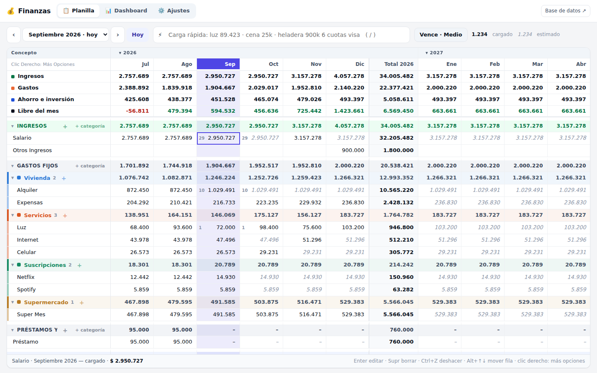
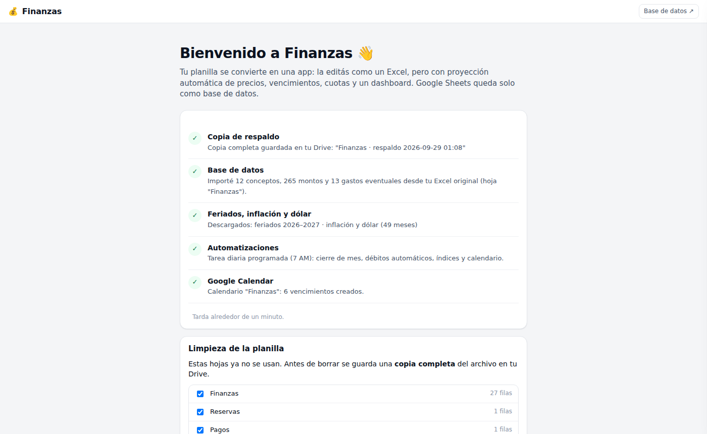
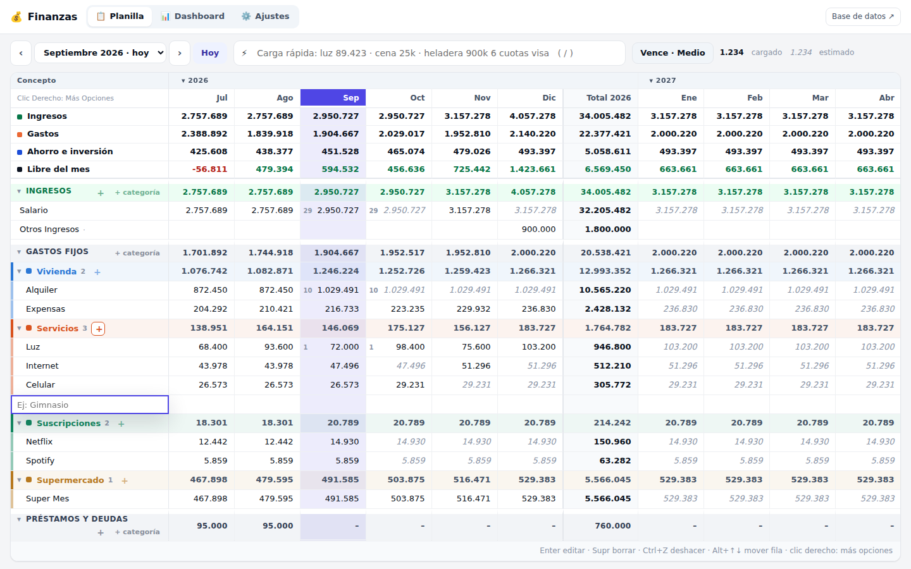
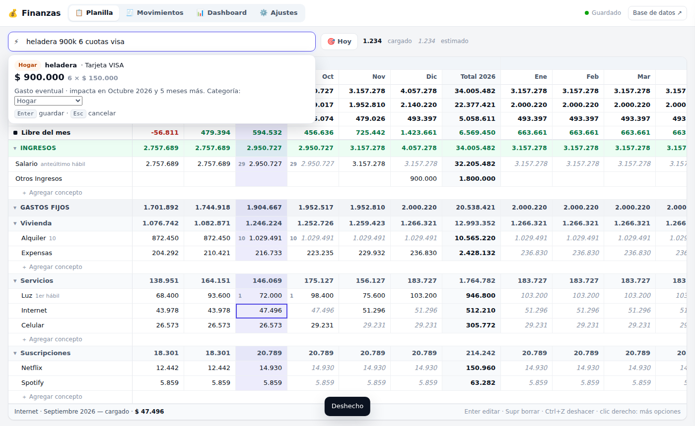
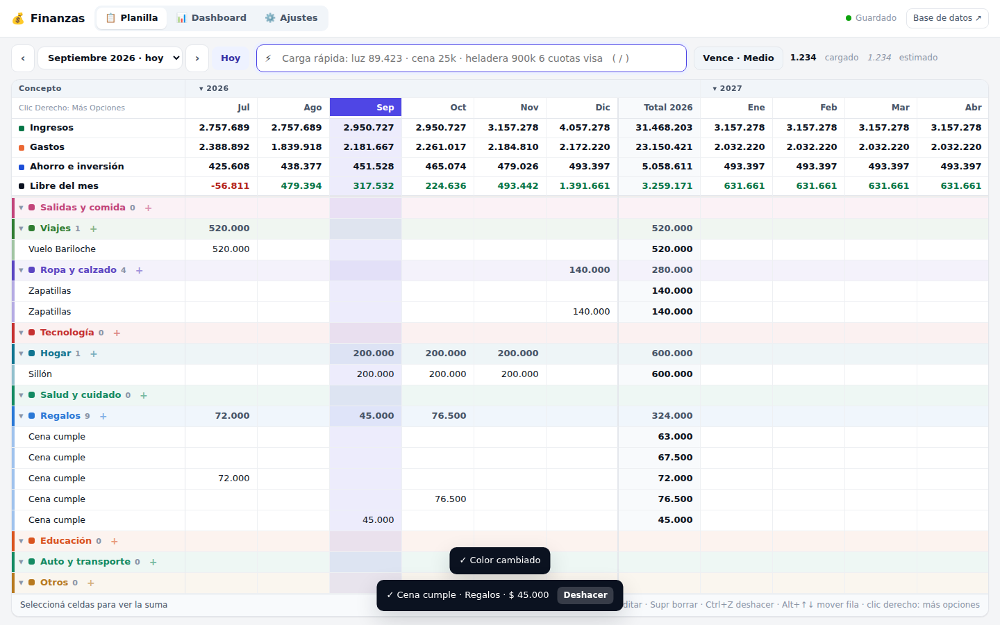
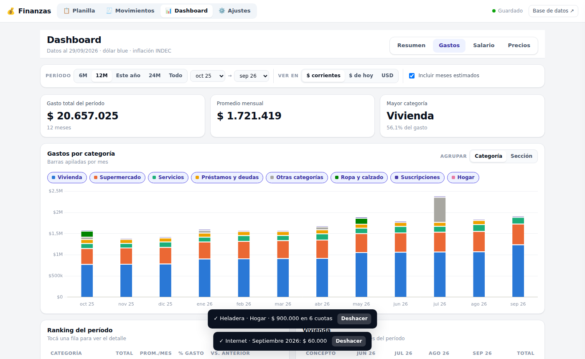
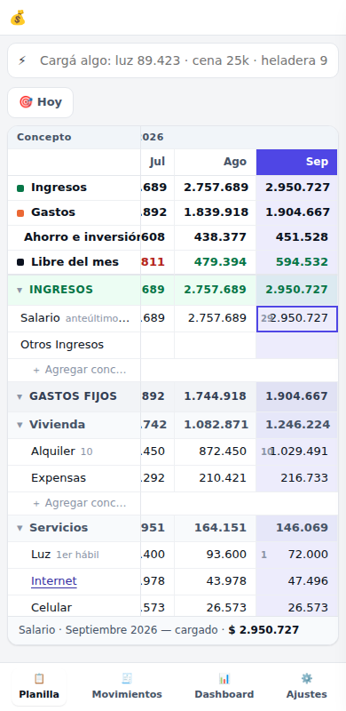

# 💰 Finanzas

App web de finanzas personales que se usa **como un Excel** y guarda todo en **Google Sheets**, que funciona como base de datos. Corre en tu propia cuenta de Google con Apps Script: nadie más ve tus datos.



- **Planilla tipo Excel, todo en celdas.** Conceptos en filas y meses en columnas. Categorías, nombres y montos se escriben en la grilla; al lado del nombre se ve el día de pago del mes elegido y el medio de pago entre paréntesis, ej. *Luz (1) (DA)*, *Alquiler (28) (T)* en febrero y *(31)* en marzo. DA = débito automático, T = transferencia, EF = efectivo, MP = Mercado Pago. Acepta cuentas (`=10615+178223`), copiar y pegar, deshacer, y muestra la suma de la selección.
- **Cualquier mes.** Con el selector ‹ mes › vas a cualquier mes pasado o futuro para cargarlo o corregirlo.
- **Balance arriba y grupos a la izquierda.** Ingresos, Gastos, Ahorro e inversión y **Resultado** (ingresos − gastos, en verde o rojo). Una columna vertical agrupa la planilla en Balance · Ingresos · Gastos · Ahorro e inversión.
- **Categorías con color, sin subcategorías.** Ingresos (Salario, Aguinaldo, Bonos, Otros), Vivienda, Servicios, Suscripciones, Transporte, Supermercado, Préstamos, Ahorro e Inversión y Eventuales. Cada una tiene su color y un **+** al lado del nombre para agregar una fila.
- **Arrastre de precios.** Si cargás un aumento en septiembre, los meses siguientes se actualizan solos. Lo que cargás vos se ve en negro; lo que estima el sistema, en *gris itálica*.
- **Siempre en el mes actual.** El mes elegido (o *Hoy*) queda como primera columna, resaltado, y los años anteriores se pliegan a su total.
- **Vencimientos en palabras.** Escribís `15`, `10 hábil`, `1er hábil` o `último hábil`, con feriados de Argentina, y se sincronizan con tu Google Calendar.
- **Carga rápida.** Escribís `heladera 900k 6 cuotas visa` y queda guardado, repartido en cuotas desde el mes siguiente.
- **Dashboard.** Salario real contra inflación (IPC INDEC), salario en dólares, aumentos por concepto y gastos por categoría, con filtros.
- **Automático.** Todos los días se cierra el mes, se confirman los débitos automáticos y se actualizan la inflación, el dólar y el calendario.

> Las capturas usan datos ficticios.

---

## Cómo se instala

La implementación es automática: cada cambio en este repositorio se sube solo a Apps Script (ver [Deploy automático](#deploy-automático)). Google solo pide dos cosas que no se pueden saltear:

1. **Abrir la app una vez.** En tu planilla, menú **💰 Finanzas → Abrir la app**. El link también queda en el resumen de cada deploy, en la pestaña Actions de GitHub.
2. **Aceptar los permisos.** Si aparece "Google no verificó esta app", tocá **Configuración avanzada → Ir a…**. Es tu propio script.

La app detecta que es la primera vez y muestra un botón **Instalar**:



| Paso | Qué hace |
|---|---|
| Copia de respaldo | Guarda una copia completa del archivo en tu Drive antes de tocar nada. |
| Base de datos | Crea las tablas e importa tus datos: la planilla de la versión 2 si existe; si no, tu Excel original. |
| Feriados, inflación y dólar | Los descarga de fuentes públicas ([ArgentinaDatos](https://argentinadatos.com), [datos.gob.ar](https://datos.gob.ar)). |
| Automatizaciones | Programa la tarea diaria de las 7 AM. |
| Google Calendar | Crea el calendario "Finanzas" con los vencimientos. |
| Limpieza | Te muestra las hojas que ya no se usan y borra las que elijas. La copia de respaldo las conserva. |

### La planilla como base de datos

Después de la instalación, el archivo de Google Sheets queda con una hoja por tabla, sin formato:

| Tabla | Una fila por… |
|---|---|
| `Conceptos` | Fila de la grilla: nombre, categoría, tipo (fijo / eventual), vencimiento, medio de pago, cómo proyectar |
| `Valores` | Fila × mes: monto, cuenta (`10615+178223`), estado (`confirmado` / `estimado`) |
| `Categorias` | Categorías (un solo nivel), con su color, orden y si suman como ingreso, gasto o ahorro |
| `Indices` | Mes: inflación, dólar oficial, dólar blue |
| `Feriados` | Feriado o día no laborable |
| `Config` | Preferencia general |

No hace falta abrirla. Si editás una tabla a mano, respetá los encabezados.

---

## Cómo se usa

### Planilla



Todo se agrega y se modifica en las celdas:

| Acción | Cómo |
|---|---|
| Cargar un monto | Seleccioná la celda y escribí: `89423`, `89.423`, `150k` o `=1500*3`. Enter para guardar. |
| Ir a otro mes | Selector **‹ Septiembre 2026 ›** arriba (o clic en el encabezado del mes). **Hoy** vuelve al mes actual. |
| Agregar una fila | **+** al lado del nombre de la categoría: aparece una fila nueva, escribís el nombre y Enter. |
| Agregar una categoría | **+ categoría** al final de la planilla, o clic derecho sobre una categoría. |
| Renombrar | Escribí sobre el nombre (fila o categoría). |
| Editar un concepto | Lápiz **✎** junto al nombre (o F4, o clic derecho → Editar): se abre un panel a la derecha con nombre, categoría, monto del mes, vencimiento (día del 1 al 28, o último / anteúltimo día, y si es hábil; muestra las fechas que resultan), medio de pago y meses futuros. |
| Porcentaje (ƒx) | En el panel del concepto, botón **ƒx** junto al monto: "20 % de Total de ingresos" (o de otro concepto). Desde el mes actual cada mes se calcula solo; un monto escrito a mano en una celda se respeta. |
| Editar una categoría | Lápiz **✎** junto al nombre de la categoría: nombre, color, si suma como ingreso, gasto o ahorro, y eliminar. |
| Editar | Doble clic, Enter o F2. |
| Moverse | Flechas, Tab, clic. Shift + flechas o arrastrar para seleccionar un rango. |
| Borrar un monto | Supr. En un mes futuro vuelve al estimado automático. Para "no se paga", escribí `0`. |
| Eliminar una fila | Seleccioná su nombre y Supr (o clic derecho → Eliminar fila). |
| Mover una fila | Alt + ↑ / ↓, o clic derecho → Subir / Bajar / Mover a categoría. |
| Copiar / pegar | Ctrl+C / Ctrl+V, también desde y hacia Excel o Sheets. |
| Deshacer / rehacer | Ctrl+Z / Ctrl+Y. |
| Confirmar un estimado | Clic derecho → **Confirmar**, o escribir el mismo valor. |
| Meses futuros, color | Clic derecho sobre la fila o la categoría. |
| Plegar | Clic en la flecha de una categoría (plegada muestra la suma de sus filas; desplegada es solo un divisor), **⊟ Plegar todo / ⊞ Desplegar todo** en la barra, o clic en un año. |
| Carga rápida | Tecla `/` o la barra ⚡ de arriba. |

Los cambios se guardan solos: arriba a la derecha dice *Guardando…* y después *Guardado*.

**Proyección** (clic derecho → Meses futuros):

| Modo | Para qué |
|---|---|
| Repetir | Sueldo, alquiler, suscripciones. Es el modo por defecto. |
| Promedio 3 meses | Gastos variables: luz, gas. |
| Ajustar por inflación | Último valor más la inflación esperada. |
| No proyectar | Aguinaldo, bonos, ingresos irregulares. |

**Vencimientos**: `15` · `10 hábil` (si cae feriado, el hábil siguiente) · `18 hábil anterior` · `1er hábil` · `5to día hábil` · `último hábil` · `anteúltimo hábil` · `último día` · `primer lunes` · `último viernes`. El día de vencimiento se ve en la celda del mes. Con medio de pago **Débito automático**, el monto se confirma solo ese día.

### Carga rápida



| Escribís | Pasa |
|---|---|
| `luz 89.423` | Confirma la luz del mes elegido y actualiza los meses siguientes. |
| `expensas 191211+11389 oct` | Guarda la cuenta en octubre. |
| `salario 3.600.000 mes que viene` | Carga el ingreso en el mes siguiente. |
| `cena 25k` | Fila nueva en Eventuales › *Salidas y comida*. |
| `heladera 900k 6 cuotas visa` | Fila nueva con $ 150.000 por mes durante 6 meses, desde el mes siguiente (tarjeta). |
| `coto 19/07 57500` | Gasto con fecha. |

Antes de guardar ves qué va a hacer, y después tenés **Deshacer**.

### Gastos eventuales y cuotas

Cada gasto suelto es una fila de la categoría **Eventuales**, como en el Excel original. Para cuotas, escribí en la celda del primer mes `600k 3c` (o `600000 x3`): se reparte $ 200.000 en ese mes y los dos siguientes. Solo se muestran las filas con montos en los años desplegados, así la grilla no crece sin fin.



### Dashboard

Tiene filtros de período, moneda (**$ corrientes**, **$ de hoy** ajustados por inflación o **USD**) y la opción de incluir o no los meses estimados.

| Vista | Qué muestra |
|---|---|
| Resumen | Ingresos, gastos, ahorro y libre del mes, con evolución y próximos vencimientos. |
| Gastos | Gastos por categoría (con los mismos colores que la planilla), ranking contra el período anterior y detalle. |
| Salario | Nominal contra real, índice contra IPC y salario en dólares. **Poder adquisitivo** indica cuánto le ganaste (o perdiste) a la inflación. |
| Precios | Qué aumentó más que la inflación y tu canasta de fijos contra el IPC. |



### Celular

La misma app funciona en el celular, con el mismo link y la sesión iniciada en tu cuenta de Google. Guardala en la pantalla de inicio.



---

## Automatizaciones

| Qué | Cuándo |
|---|---|
| Proyectar meses futuros (arrastre) | Al guardar un monto y todas las mañanas |
| Cerrar el mes: los estimados del mes que terminó pasan a confirmados | El primer día de cada mes |
| Confirmar débitos automáticos | El día del vencimiento |
| Eventos en Google Calendar, con aviso a las 9:00 del día anterior | Todas las mañanas; ✓ en el título cuando ya está pagado |
| Inflación y dólar | Semanal |
| Feriados del año siguiente | Desde octubre |

Todo se ajusta en **⚙️ Ajustes**: horizonte de proyección, calendario, medios de pago, feriados propios, etc.

---

## Deploy automático

El workflow [`.github/workflows/deploy-apps-script.yml`](.github/workflows/deploy-apps-script.yml) corre los tests y sube `apps-script/` a tu proyecto con [clasp](https://github.com/google/clasp) en cada push. Si Google rechaza algo, el workflow falla y muestra el motivo. La URL de la app queda en el resumen de cada ejecución.

Configuración (una sola vez):

1. Activá la API de Apps Script: <https://script.google.com/home/usersettings>.
2. Iniciá sesión con clasp y copiá el contenido de `~/.clasprc.json`. Sin Node en tu computadora, podés hacerlo desde GitHub → Code → Codespaces:
   - En una terminal, corré `npx @google/clasp@2.4.2 login`.
   - Abrí el link que aparece y autorizá tu cuenta. La página final da error: es normal. Copiá su dirección completa.
   - En una segunda terminal, corré `curl "<dirección copiada>"` (con comillas).
   - Corré `cat ~/.clasprc.json` y copiá el resultado.
3. Andá a GitHub → **Settings → Secrets and variables → Actions** y cargá dos secretos:
   - `CLASPRC_JSON`: el contenido completo del archivo.
   - `SCRIPT_ID`: el ID del proyecto. Lo encontrás en el editor de Apps Script de la planilla, **Configuración del proyecto → ID de la secuencia de comandos**.

Cada deploy **reemplaza todos los archivos** del proyecto de Apps Script. Tus datos no se tocan: están en las hojas.

---

## Preguntas frecuentes

**¿Puedo seguir editando la planilla de Google Sheets?** Sí. Es la base de datos y la app lee lo que haya. Pero la forma cómoda de editar es la app.

**¿Dónde están mis datos?** En tu planilla de Google Sheets y en tu calendario. El script corre con tu cuenta. Las únicas consultas externas son públicas (inflación, dólar, feriados) y no envían nada tuyo.

**Borré una hoja que necesitaba.** Durante la instalación y antes de cada limpieza se guarda una copia completa en tu Drive: "*nombre* · respaldo *fecha*".

**¿Por qué un valor está en gris?** Es un estimado. Escribilo o usá clic derecho → **Confirmar**. Al empezar el mes siguiente se confirma solo.

**Cancelé algo, ¿cómo lo saco de los meses siguientes?** Escribí `0` en el primer mes que ya no se paga.

---

## Para desarrollar

```
apps-script/            código (lo que sube el deploy)
  Main.js               doGet (app web) y menú de la planilla
  Api.js                funciones que usa la app (google.script.run)
  Db.js · Config.js     tablas y configuración
  Modelo.js             conceptos, valores, categorías, proyección, vencimientos
  Proyeccion.js         arrastre de precios (lógica pura)
  Fechas.js · Montos.js reglas de vencimiento y días hábiles · números argentinos y cuentas
  Categorias.js         a qué categoría va cada concepto al importar o actualizar
  Indices.js            inflación, dólar y feriados
  Calendario.js         Google Calendar
  Tareas.js             tarea diaria
  Instalacion.js        instalación, respaldo, limpieza de hojas y actualización automática de la base
  Legado.js             importación del Excel original y de la versión 2
  App.html              página de la app (incluye los demás .html)
  Estilos.html · Nucleo.html · Grilla.html · Tablero.html · AppJs.html
tests/                  tests con Node + simulador de Google Sheets
scripts/preview.js      la app completa en el navegador, con el servidor real sobre el simulador
docs/DISEÑO.md          decisiones de diseño
```

```bash
npm test          # reglas de fechas, montos, proyección, núcleo de la app, instalación y API de punta a punta
npm run preview   # genera preview/app.html (abrilo en el navegador)
```
